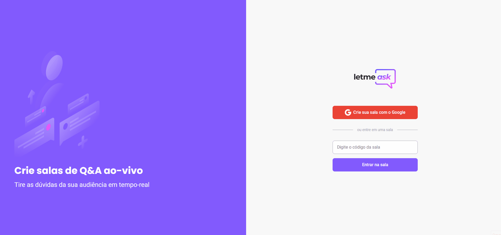
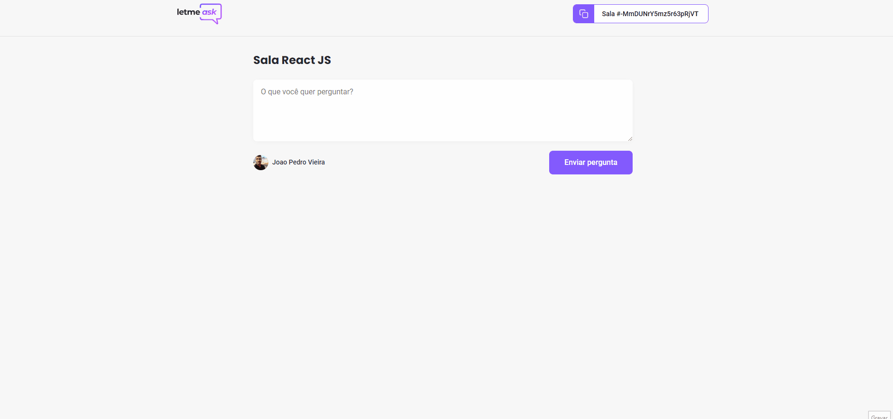

<p align="center">
  
</p>

<p align="center">
  

  

  
  <a href="https://github.com/DevJPVR/ShoppingCart/commits/master">
    
  </a>
    
   
   <a href="https://github.com/DevJPVR/Let-meask/blob/main/LICENSE">


  <a href="#">
    
  </a>
  

 
</p>


<h1 align="center">
    
</h1>


<h1 align="center">
    
</h1>

<br>

## 🧪 Tecnologias

Esse projeto foi desenvolvido com as seguintes tecnologias:

- [React](https://reactjs.org)
- [Firebase](https://firebase.google.com/)
- [TypeScript](https://www.typescriptlang.org/)

## 🚀 Como executar

Clone o projeto e acesse a pasta do mesmo.

```bash
$ git clone https://github.com/DevJPVR/Let-meask
$ cd Let-meask
```

Para iniciá-lo, siga os passos abaixo:
```bash
# Instalar as dependências
$ yarn
# Iniciar o projeto
$ yarn start
```
O app estará disponível no seu browser pelo endereço http://localhost:3000.

Lembrando que será necessário criar uma conta no [Firebase](https://firebase.google.com/) e um projeto para disponibilizar um Realtime Database.

## 💻 Projeto

Letmeask é perfeito para criadores de conteúdos poderem criar salas de Q&A com o seu público, de uma forma muito organizada e democrática. 

Esse projeto foi desenvolvido junto com a equipe da RocketSeat, durante a semana do NLW.


## 🔖 Layout

Você pode visualizar o e testar o projeto através do link a baixo:

- [Layout Web](https://letmeask-12e88.web.app/) 

## 📝 License

Esse projeto está sob a licença MIT. Veja o arquivo [LICENSE](LICENSE.md) para mais detalhes.

---

Feito com 💜 by JoãoPedro
